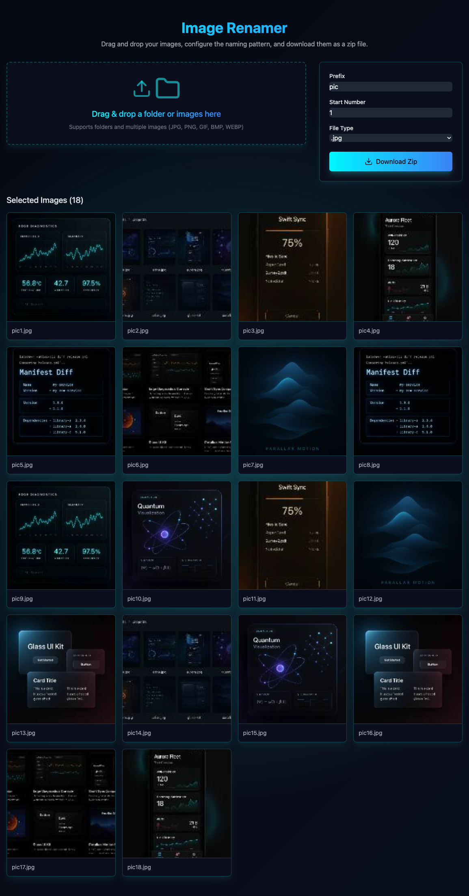

# Image Renamer

Image Renamer is a Vite + React + TypeScript application that batch-renames images using configurable prefixes, numbering, and extensions, then packages everything into a downloadable ZIP. The UI is optimized for drag-and-drop workflows and gives instant previews of the updated filenames so you can validate the pattern before exporting.



## Features
- **Drag & Drop uploads** powered by `react-dropzone` with live thumbnail previews.
- **Flexible naming rules** for prefix, starting number (no forced padding), and extension.
- **Instant feedback** as removal or configuration changes update all filenames in place.
- **One-click ZIP export** using `JSZip` + `file-saver`, with automatic reset after download.
- **Tailwind-driven cyber theme** responsive across desktop and mobile.

## Project Structure
```
src/
  App.tsx          # Main layout and state management
  components/      # DropZone, ConfigForm, ImageList UI pieces
  utils/           # File helpers (previews, renaming, zip)
  types/           # Shared TypeScript contracts
```
Build/tooling config lives at the repo root (`vite.config.ts`, `tailwind.config.js`, `eslint.config.js`, `tsconfig*.json`). Screenshots for documentation live under `screenshots/`.

## Getting Started
1. **Prerequisites**: Node.js ≥ 18 and npm.
2. **Install**:
   ```bash
   npm install
   ```
3. **Run locally**:
   ```bash
   npm run dev
   ```
   Visit `http://localhost:5173`.

## Available Scripts
- `npm run dev` – start the Vite dev server with hot reload.
- `npm run build` – create a production build in `dist/`.
- `npm run preview` – serve the production build locally for smoke tests.
- `npm run lint` – run ESLint using the flat config.

## Usage
1. Drop or browse for JPG/PNG/GIF/BMP/WEBP images.
2. Set the prefix, starting number, and desired extension in the Config panel.
3. Remove unwanted files from the preview grid as needed.
4. Click **Download Zip** to export; the view resets automatically so you can start another batch.

## Development Notes
- Use functional components and hooks; keep business logic in `src/utils`.
- Tailwind utilities and custom `cyber-*` classes handle styling—avoid inline styles unless necessary.
- Tests are not yet implemented; when adding them, prefer Vitest + React Testing Library mirrored under `src/**/__tests__`.

## License
MIT License. See `LICENSE` for details.
